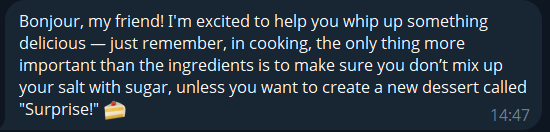
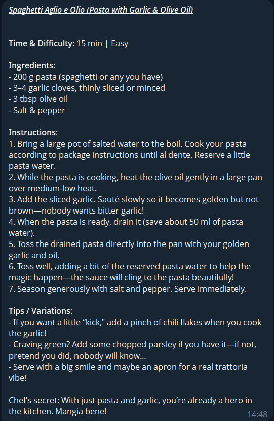
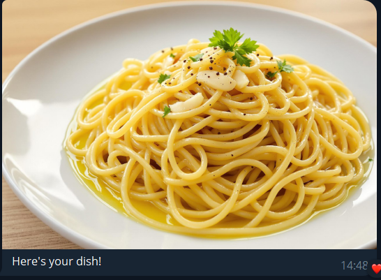

# Kitchen Assistant in Telegram

This repository contains an implementation of a kitchen assistant bot for Telegram, designed to help users find recipes based on the ingredients they have. The bot uses OpenAI's GPT model to generate recipes and provides a friendly, humorous interaction style. It also generates images of the final dish using Replicate API.

## Installation

It is recommended to use Docker for installation to ensure a consistent environment. The Dockerfile provided in this repository sets up the necessary dependencies and configurations.

To build the image, run the following command in the terminal:

```
docker build  -f Dockerfile --rm -t kassistant:latest .
```

To run the container, use the following command:

```
docker run -it --rm \
            --gpus all \
           -v /full/path/to/project:/app \
           kassistant:latest \
           bash
```
Note: The `--gpus all` flag is used to enable GPU support. If you don't have a GPU, you can remove this flag.

## Running the Bot

To run the kitchen assistant bot, you need to set up your environment variables. Create a `.env` file in the root directory of the project with the following content:

```env
OPENAI_API_KEY=your_openai_api_key
REPLICATE_API_TOKEN=your_replicate_api_token
TELEGRAM_TOKEN=your_telegram_bot_token
```

To obtain you Telegram bot token, you can create a new bot using the `BotFather` on Telegram. Once you have your `.env` file set up, you can run the bot using the following command:

```
python bot.py
```

## Example Usage

Once the bot is running, you can interact with it in Telegram. Start a chat with /start command, and the bot will prompt you to enter the ingredients you have. For example:

You:
```
Hello!
```
The bot:


You:
```
/start
```
The bot:



You:
```
I have garlic and pasta
```
The bot:




You will also be able to check the recipe and the generated image in `output/` directory.

Happy cooking!